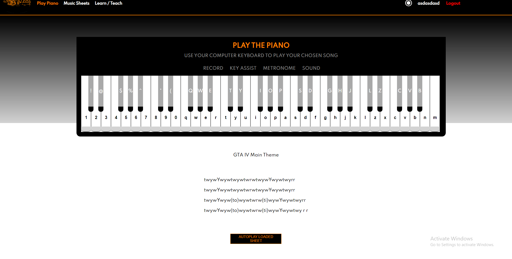

This project is a virtual piano website with options to play the piano, upload your music sheet, message other users, or let others know you are interested in learning/teaching.

Admins have the ability to delete or edit user sheets (example admin hardlane2000 hardlane17)

Hosted app on Heroku: http://pythonflaskvirtualpiano.herokuapp.com/

Happy browsing and thank you for visiting!